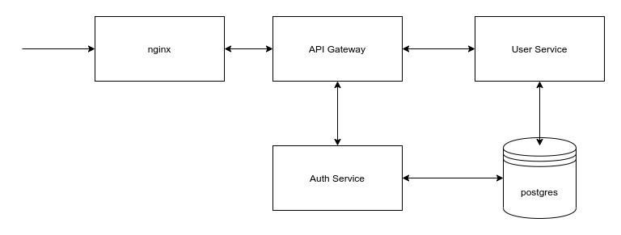

# Задание 

Backend for frontends. Apigateway

Цель:
В этом ДЗ вы научитесь добавлять в приложение аутентификацию и регистрацию пользователей.

Добавить в приложение аутентификацию и регистрацию пользователей.

Реализовать сценарий "Изменение и просмотр данных в профиле клиента":

* Пользователь регистрируется.
* Заходит под собой и по определенному урлу получает данные о своем профиле.
* Может поменять данные в профиле.
* Данные профиля для чтения и редактирования не должны быть доступны другим клиентам (аутентифицированным или нет).
  
На выходе должны быть:  
  
0) описание архитектурного решения и схема взаимодействия сервисов (в виде картинки)  
1) команда установки приложения (из helm-а или из манифестов). Обязательно указать в каком namespace нужно устанавливать. 1*) команда установки api-gateway, если он отличен от nginx-ingress.  
2) тесты постмана, которые прогоняют сценарий:

* регистрация пользователя 1
* проверка, что изменение и получение профиля пользователя недоступно без логина
* вход пользователя 1
* изменение профиля пользователя 1
* проверка, что профиль поменялся
* выход* (если есть)
* регистрация пользователя 2
* вход пользователя 2
* проверка, что пользователь2 не имеет доступа на чтение и редактирование профиля пользователя1.
  
В тестах обязательно:

* наличие {{baseUrl}} для урла
* использование домена arch.homework в качестве initial значения {{baseUrl}}
* использование сгенерированных случайно данных в сценарии
* отображение данных запроса и данных ответа при запуске из командной строки с помощью newman.

# Архитектура


Аутентификация происходит через JWT, который создается и подписывается приватным ключом в auth-сервисе. Api-gateway забирает из auth-сервиса публичный ключ в формате JWK и проверяет подпись токена, который пользователи передают в хедере Authorization. Токен содержит id пользователя, который дальше уже прокидывается в соотстветующие запросы, таким образом разграничивается доступ пользователей к пользовательским данным. 

# Подготовка среды
## Вырубить валидацию для ingress
```
kubectl delete -A ValidatingWebhookConfiguration ingress-nginx-admission
```
## Добавить репозитории helm
```
helm repo add bitnami https://charts.bitnami.com/bitnami
helm repo add ingress-nginx https://kubernetes.github.io/ingress-nginx
helm repo update
```
## Создать неймспейс
```
kubectl create namespace otus
kubectl config set-context --current --namespace=otus
```

# Порядок установки
* postgres
* otus-auth
* otus-user
* otus-api-gateway
* nginx-ingress

## nginx-ingress
```
helm install nginx ingress-nginx/ingress-nginx -f ./nginx-ingress/values.yaml --atomic -n otus
```
## postgres
```
helm install postgres bitnami/postgresql -f ./postgres/values.yaml -n otus
```
## otus-auth
```
helm install otus-auth ./otus-auth/otus-auth-chart -f ./otus-auth/values.yaml -n otus
```
## otus-user
```
helm install otus-user ./otus-user/otus-user-chart -f ./otus-user/values.yaml -n otus
```
## otus-api-gateway
```
helm install otus-api-gateway ./otus-api-gateway/otus-api-gateway-chart -f ./otus-api-gateway/values.yaml -n otus
```
# Api-тесты из Postman 
Предварительно необходимо изменить хост arch.homework на ip ingress'а или изменить дефолтный в user_api_postman_collection.json

```newman run tests/API_Gateway_Tests.postman_collection.json```
